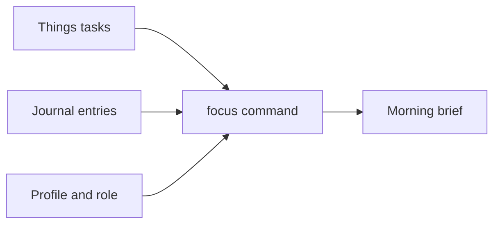

# Dispatch

A small system that turns your task list and a daily journal into a three-minute morning briefing. It runs on Claude Code, reads your tasks from Things and your reflections from plain markdown files, and writes you a brief each morning that says what to focus on and why.

Inspired by [jibbajabba/brain](https://github.com/jibbajabba/brain). This is my own take on the same idea, built around Things, Raycast, and a role-based brief.

## What it's for

Most task tools tell you what's on your plate. They don't tell you what state you're in, or which of those tasks matters most today given the role you're trying to play. This system adds that layer.

It keeps two inputs separate and brings them together once a day. Your tasks live in Things and never leave it. Your journal is a line or two a day about where your head is. Each morning you run one command and get a brief that reads your journal for signal, pulls your live tasks, and reprioritises them against a role you've defined. Work and personal are separate contexts with separate roles, so the same command gives you a work brief or a personal one.

## How it works

Three parts, each doing one job.

**Things, for tasks.** Your tasks stay in Things. The briefing reads them live through the `things-mcp` server, so there's no export step and no second copy to keep in sync.

**Raycast, for journal capture.** A bundled Raycast extension lets you jot a reflection in a second. It appends to today's journal file as a plain markdown list item. Two markers carry weight: a line starting `→` is a reflection to carry forward, and a line starting `!!` is something you're avoiding.

**Claude Code, for the brief.** A `/focus` command reads your profile, the last week of journal entries, and your live tasks, then writes the brief. The rules it follows live in `CLAUDE.md`: the briefing structure, the journal conventions, and your writing voice.



## The brief

Five parts, built to read in three minutes.

1. **Top three today.** The three tasks that matter most in the active context, judged against your role. Never more than three.
2. **The thing you're avoiding.** Pulled from your profile's growth edges, open threads, and any `!!` lines from your journal. Named plainly, not softened.
3. **Hard deadlines.** Any tasks with a specific deadline, shown every day until they pass.
4. **From your journal.** `!!` flags folded in, `→` reflections surfaced, recurring patterns named. If you haven't written for three days, that gap is noted too.
5. **Sit with this.** One short question drawn from your profile's growth edges, to carry through the day. Rotates, never repeats two days running.

## The daily loop

Through the day, jot reflections with the Raycast command as they occur. Mark the ones worth carrying with `→`, and the ones you're dodging with `!!`. In the morning, run `/focus work` (or `personal`, or `all`) in Claude Code from the repo folder, and read what comes back.

The journal is what makes this more than a sorted task list, and it's the part that takes a habit to build. One entry does little. The value shows up after a couple of weeks, when the brief starts noticing the thing you've flagged four times and names it back to you.

## Commands

`/focus` is the morning briefing. It takes an argument:

- `/focus work` reads your Work area, judged against your work role.
- `/focus personal` reads your Personal area, judged against your personal role.
- `/focus all` does both, with a shared opening read of the journal.
- bare `/focus` defaults to work.

## Structure

```
dispatch/
├── README.md
├── SETUP.md
├── CLAUDE.md                       # the rules: briefing spec, journal conventions, voice
├── .mcp.json                       # registers the Things MCP server
├── .gitignore
├── me/
│   └── profile.example.md          # copy to profile.md and fill in (profile.md is gitignored)
├── journals/                       # daily entries, YYYY_MM_DD.md (gitignored)
├── .claude/
│   └── commands/
│       └── focus.md                # the /focus command
└── raycast/
    └── journal-entry/              # the bundled journal-capture extension
        ├── package.json
        ├── tsconfig.json
        ├── README.md
        ├── src/journal-entry.tsx
        └── assets/extension-icon.png
```

## Setup

See [SETUP.md](SETUP.md). It takes you from installing Claude Code to your first brief, about half an hour the first time.

## Make it yours

The repo ships with my config as a working example. Three things are yours to replace: your roles in `me/profile.md`, your writing voice in the `## My voice` section of `CLAUDE.md`, and your two contexts if work and personal don't match how you split your life. SETUP.md covers each.

The system assumes a Mac, because it leans on Things and Raycast. If you don't use Raycast, anything that writes a `- ` line to `journals/YYYY_MM_DD.md` will do, the brief only cares about the files.

## Credit

The file-based, command-driven shape comes from [jibbajabba/brain](https://github.com/jibbajabba/brain). This version swaps the task source for Things, the capture for Raycast, and adds the role-based reprioritisation.

## License

MIT. See the manifest for details, and replace the author field with your own before publishing the extension.
